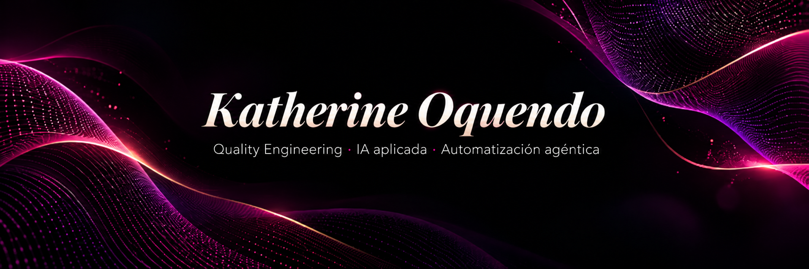

  

---

Soy **Quality Engineer** con experiencia en aseguramiento de calidad, automatización de pruebas y construcción de soluciones apoyadas por inteligencia artificial.

Mi trabajo está evolucionando hacia la intersección entre **Software Testing, Applied AI, Agentic Automation y AI-assisted Development**, buscando convertir procesos repetitivos, necesidades operativas y riesgos de calidad en soluciones más eficientes, trazables y reutilizables.

Actualmente combino mi experiencia en QA con herramientas como **Codex, Claude Code, Cowork y Ollama**, explorando nuevas formas de diseñar, desarrollar, probar y mejorar software con apoyo de agentes de IA.

---

## 🎯 Lo que hago

🧪 **Quality Engineering**  
Diseño pruebas, escenarios de riesgo, criterios de aceptación y evidencias que permiten tomar mejores decisiones sobre la calidad de un producto.

⚙️ **QA Automation**  
Automatizo pruebas web y API utilizando diferentes herramientas, patrones y frameworks de testing.

🤖 **IA aplicada**  
Diseño asistentes, flujos, prompts, contextos y artefactos reutilizables para mejorar tareas relacionadas con desarrollo, testing, análisis y documentación.

🧩 **Agentic Automation**  
Exploro sistemas donde agentes de IA colaboran con herramientas, conocimiento y reglas para resolver procesos de varios pasos.

💻 **AI-assisted Development**  
Utilizo herramientas de desarrollo asistido por IA para acelerar análisis, generación, refactorización, documentación y experimentación técnica.

🔎 **Testing basado en riesgo**  
Busco mantener una relación clara entre:

**requisito → riesgo → prueba → evidencia → decisión**

---

## 🛠️ Tecnologías y herramientas

### 🤖 IA, agentes y desarrollo asistido

`ChatGPT` · `Codex` · `Claude` · `Claude Code` · `Cowork`  
`Gemini` · `NotebookLM` · `Ollama`

`Prompt Design` · `Context Design` · `AI Assistants`  
`Agentic Automation` · `AI-assisted Development`  
`Guardrails` · `Local LLMs`

### 🧪 Testing & QA Automation

`Selenium WebDriver` · `Serenity BDD` · `Playwright`  
`Cucumber` · `Gherkin / BDD` · `Rest Assured`  
`Postman` · `Tricentis Tosca`

### 💻 Desarrollo

`Java` · `JavaScript` · `Python`  
`SQL` · `MySQL` · `Node.js` · `Angular`

### 📋 Gestión y colaboración

`Jira` · `Azure DevOps`

---

## 💼 Experiencia profesional

Actualmente trabajo en **Sofka**, dentro de una fábrica de testing para **GNP**, participando en actividades de aseguramiento de calidad sobre funcionalidades de negocio.

Mi experiencia incluye:

- pruebas funcionales y de regresión;
- automatización de pruebas;
- validación de servicios API;
- análisis de escenarios y riesgos;
- documentación de evidencias;
- comunicación y seguimiento de defectos;
- trazabilidad entre requerimientos, pruebas y resultados.

También he tenido experiencia en servicio al cliente y automatización industrial, antecedentes que hoy complemento con Quality Engineering e inteligencia artificial aplicada.

---

## 🚀 En qué estoy trabajando

Actualmente estoy profundizando en la integración entre **QA e inteligencia artificial**, especialmente en:

- 🤖 asistentes especializados de IA;
- 🧩 sistemas y flujos agénticos;
- 💻 desarrollo asistido con **Codex** y **Claude Code**;
- 🧠 experimentación con modelos locales mediante **Ollama**;
- 🧪 Software Testing Intelligence;
- 🔐 guardrails y evaluación de sistemas con IA;
- 📊 trazabilidad y quality gates;
- ⚡ automatización de procesos;
- 🔄 integración entre testing, desarrollo e IA aplicada.

---

## 🧠 MetodologIA

Formo parte de **MetodologIA**, una iniciativa enfocada en educación, herramientas y soluciones relacionadas con **Quality Engineering e inteligencia artificial aplicada**.

Desde allí participo en la creación y exploración de:

- herramientas especializadas;
- asistentes de IA;
- frameworks de trabajo;
- artefactos reutilizables;
- metodologías de testing;
- contenidos y entrenamientos;
- formas responsables de integrar IA en procesos de calidad.

---

## 🎓 Formación y certificaciones

- 🎓 **Tecnología en Automatización Industrial** — SENA
- 🧪 Formación especializada en Quality Assurance y automatización
- 📊 Formación en Análisis de Datos y Machine Learning — Universidad de Antioquia
- ✅ Tricentis Tosca — AS1
- ✅ Tricentis Tosca — AS2
- ✅ Tricentis Tosca — AE1
- ✅ Tricentis Tosca — TDS1

Mi aprendizaje actual está enfocado especialmente en:

`IA aplicada` · `Agentes` · `Java` · `Python` · `SQL` · `Testing moderno` · `Quality Engineering`

---

## 🌐 Mi hoja de vida

Mi CV interactivo presenta con mayor detalle mi experiencia, proyectos, formación y enfoque profesional.

### 👉 [Ver mi hoja de vida interactiva](https://katherinoquendo.github.io/)

---

## 🤝 Conectemos

Me interesan oportunidades, proyectos y conversaciones alrededor de:

**🤖 Applied AI**  
**🧪 Quality Engineering**  
**⚙️ QA Automation**  
**🧩 Agentic Automation**  
**💻 AI-assisted Development**  
**🚀 Automatización y mejora de procesos**

📍 Colombia

🔗 [LinkedIn](linkedin.com/in/katherinoquendo)

---

> **Construyo en la intersección entre calidad, automatización e inteligencia artificial.**
